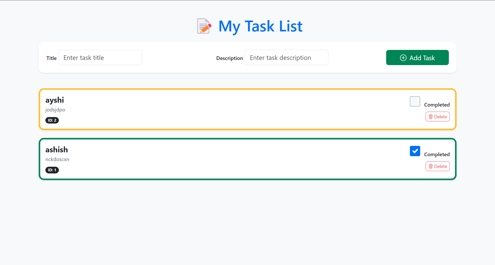
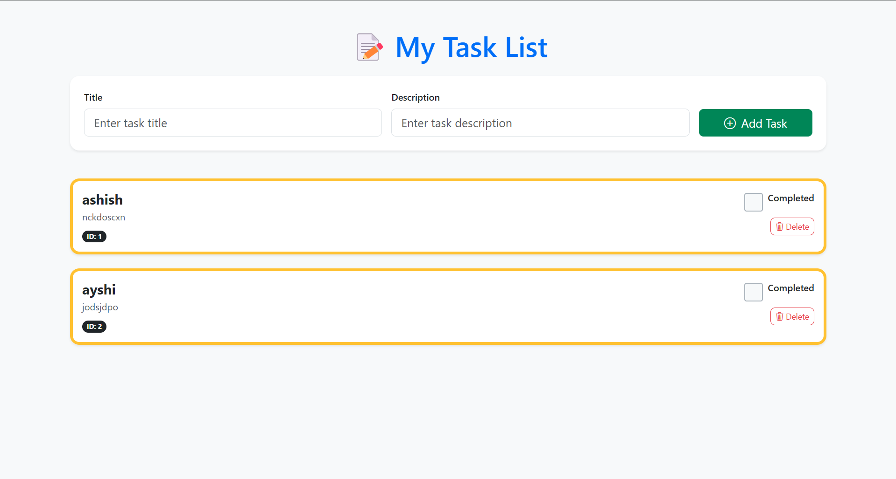

# ✅ ToDo App — Spring Boot + Thymeleaf + Bootstrap

A clean, intuitive task management application built with **Spring Boot**, **Thymeleaf**, and **Bootstrap**. Create, complete, and delete tasks — all with a responsive UI and smooth user experience.


---

## ✨ Features

- ✅ Add new tasks with title & description
- ✍️ Mark tasks as completed
- ❌ Delete tasks easily
- 💡 Visual indicators (color-coded tasks: completed vs. pending)
- 🌐 Responsive layout using **Bootstrap 5**
- 🛡️ Backend powered by **Spring Boot APIs**
- 🧠 Templating with **Thymeleaf**

---

## 📸 Screenshots

| Task Form      | Task List |
|----------------|-----------|
|  |  |

---

## ⚙️ Tech Stack

- **Backend**: Java 21, Spring Boot
- **Frontend**: Thymeleaf, Bootstrap 5
- **Build Tool**: Maven
- **Database**: MySQL
- **IDE**: IntelliJ IDEA


## 🧪 API Endpoints

| Method | Endpoint                      | Description                          |
|--------|-------------------------------|--------------------------------------|
| GET    | `/api/tasks`                  | Display the list of all tasks        |
| POST   | `/api/tasks`                  | Add a new task                       |
| POST   | `/api/tasks/{id}`             | Toggle completion status of a task   |
| POST   | `/api/delete/tasks/{id}`      | Delete a task by its ID              |


## 📁 Project Structure

Todo/
├── src/
│   └── main/
│       ├── java/
│       │   └── com/todo/
│       │       ├── controller/          # Controllers and route handlers
│       │       ├── model/               # Entity classes
│       │       ├── repositories/        # Spring Data JPA repositories
│       │       ├── service/             # Business logic
│       │       └── TodoApplication.java # Main Spring Boot class
│       └── resources/
│           ├── static/
│           │   └── images/              # Screenshots for documentation
│           ├── templates/               # Thymeleaf HTML templates
│           └── application.properties   # Configuration file
├── pom.xml
└── README.md


---

## 🚀 Getting Started

### 📦 Prerequisites

- Java 21+
- Maven
- Git


## 🧑‍💻 Author

**ubinox-pi**

- 🔗 GitHub: [ubinox-pi](https://github.com/ubinox-pi)
- 💬 Open to collaboration or feature suggestions
- 🧡 Feel free to star ⭐ the repo if you like it!


## 🙌 Contributions

Contributions are warmly welcome!

If you'd like to:
- Add a new feature 💡
- Fix a bug 🐞
- Improve the UI/UX 🎨
- Write better documentation 📚

Feel free to:

1. 🍴 Fork the repository
2. 🛠️ Create a new branch (`git checkout -b feature/your-feature`)
3. 🧪 Make your changes
4. ✅ Commit and push (`git commit -m "Add: feature name"`)
5. 🔁 Open a pull request

> Together, we build better!


### 🛠️ Run Locally

```bash
# Clone the repository
git clone https://github.com/ubinox-pi/Spring-project.git
cd Spring-project

Change the database connection settings in `src/main/resources/application.properties`

# Build the project
mvn clean install

# Run the application
mvn spring-boot:run


